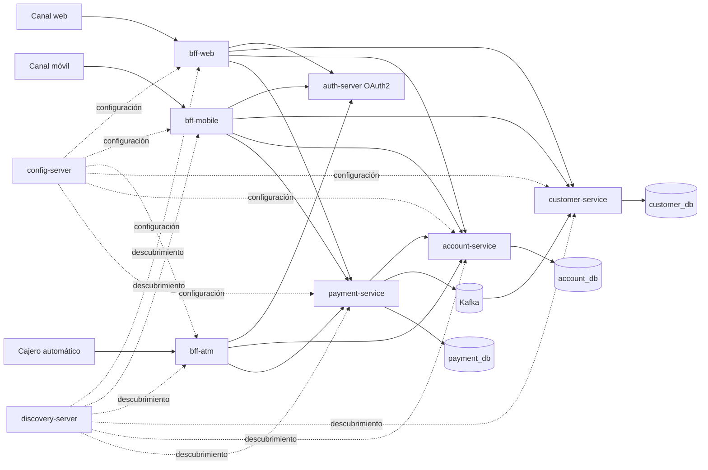

# Plataforma de modernización Banco XYZ

Este proyecto reemplaza procesos bancarios legacy por una plataforma modular basada en Spring Batch, Backend for Frontend y microservicios. La solución separa las responsabilidades de clientes, cuentas y pagos, adapta las respuestas a cada canal y conserva controles de seguridad, resiliencia y trazabilidad para las operaciones financieras.

## Capacidades principales

La modernización se organiza en cinco áreas que trabajan de forma integrada:

1. **Procesamiento batch:** migra movimientos diarios, cálculo mensual de intereses y estados financieros anuales a jobs reiniciables y paralelos.
2. **Servicios por dominio:** separa clientes, cuentas y pagos para que cada área pueda evolucionar y escalar de manera independiente.
3. **Experiencias por canal:** ofrece BFF específicos para web, móvil y cajero automático, con contratos ajustados a cada uso.
4. **Seguridad distribuida:** utiliza OAuth2, JWT, scopes por canal y propagación controlada del token entre servicios.
5. **Mensajería asíncrona:** publica transacciones completadas y alertas de seguridad en Kafka para desacoplar procesos posteriores.

## Decisiones de diseño

El sistema responde a necesidades concretas del negocio:

- **Procesar un volumen creciente sin extender las ventanas operativas.** Los jobs dividen los archivos en particiones, procesan chunks en paralelo y escriben lotes JDBC.
- **Proteger las operaciones monetarias frente a reintentos y concurrencia.** Pagos y retiros exigen claves de idempotencia; las cuentas aplican bloqueo pesimista y control de versión.
- **Mantener los canales disponibles cuando un servicio presenta problemas.** Las consultas usan circuit breakers y respuestas parciales, mientras que las operaciones financieras devuelven un error explícito y evitan simular resultados exitosos.
- **Permitir que cada canal y dominio evolucione por separado.** Los BFF y microservicios son aplicaciones independientes, descubiertas dinámicamente mediante Eureka.
- **Conservar trazabilidad en un entorno distribuido.** Los pagos registran su estado, publican eventos y aplican compensación cuando una transferencia no logra acreditar la cuenta de destino.

## Arquitectura



## Componentes

| Componente | Responsabilidad | Puerto local |
|---|---|---:|
| `batch-service` | Procesamiento de movimientos, intereses y estados financieros | 8086 |
| `bff-web` | Dashboard completo y creación de pagos | 8081 |
| `bff-mobile` | Resumen ligero y transferencias | 8082 |
| `bff-atm` | Consultas de saldo y retiros | 8083 |
| `config-server` | Configuración centralizada | 8888 |
| `discovery-server` | Registro y descubrimiento Eureka | 8761 |
| `auth-server` | Emisión de tokens OAuth2 y llaves JWT | 9000 |
| `customer-service` | Perfiles de clientes y consumo de eventos | 8091 interno |
| `account-service` | Apertura, movimientos y cierre de cuentas | 8092 interno |
| `payment-service` | Pagos, transferencias, depósitos y retiros | 8093 interno |

## Procesamiento batch

Los tres jobs leen los nueve CSV de la fuente legacy y conservan los registros con problemas de negocio como anomalías revisables. Solo las filas que no pueden interpretarse estructuralmente se omiten dentro de un límite configurado.

- `movimientosDiariosJob`: valida movimientos y genera resúmenes por fecha.
- `interesesMensualesJob`: calcula intereses para cuentas de ahorro y préstamos. Lee los archivos `intereses_trimestrales.csv` porque ese es el nombre original de la fuente.
- `estadosFinancierosAnualesJob`: consolida depósitos, retiros, compras y pagos por cuenta.

Cada job incluye reintentos para fallos transitorios de base de datos, particionamiento por archivo, auditoría de ejecución y reinicio automático con un máximo configurable.

## Canales y seguridad

Cada BFF exige un scope propio:

| Canal | Scopes |
|---|---|
| Web | `web` |
| Móvil | `mobile` |
| Cajero consulta | `atm.read` |
| Cajero retiro | `atm.withdraw` |

Los tokens se emiten mediante `client_credentials` y se validan nuevamente en cada servicio de negocio. HTTPS se puede activar en los BFF mediante variables de entorno y un certificado PKCS12.

## Resiliencia y consistencia

Las llamadas remotas utilizan Resilience4j y balanceo por nombre de servicio. Las consultas pueden responder información parcial cuando una dependencia no está disponible. Las operaciones que modifican dinero usan idempotencia, bloqueo de saldo y una compensación que devuelve el monto a la cuenta de origen si falla el crédito de destino.

Kafka utiliza los tópicos `bancoxyz.transacciones.completadas` y `bancoxyz.alertas.seguridad`. El servicio de clientes actualiza la última actividad del cliente y persiste las alertas recibidas de forma idempotente.

Compose ejecuta un inicializador de Kafka antes de los servicios de negocio. De esta forma, ambos tópicos existen con tres particiones antes de que se conecten los productores y consumidores.

## Inicio rápido

Requisitos: Java 17 o superior, Maven 3.9 o superior y Docker Desktop con Compose v2.

```bash
mvn -B clean test
mvn -B -DskipTests package
docker compose up -d --build
docker compose ps
```

También puede ejecutarse la validación completa y reproducible con:

```bash
./scripts/demo-local.sh
```

El script genera datos únicos, escala los servicios de negocio, valida el flujo integral y conserva los resultados en `docs/evidencias/ultima-ejecucion`.

Obtener un token móvil:

```bash
TOKEN_MOBILE=$(curl -sS -u bff-mobile:mobile-secret \
  -d 'grant_type=client_credentials&scope=mobile' \
  http://localhost:9000/oauth2/token | jq -r .access_token)
```

Comprobar salud y descubrimiento:

```bash
curl http://localhost:8082/actuator/health
curl -H 'Accept: application/json' http://localhost:8761/eureka/apps
```

Detener los contenedores sin eliminar los datos:

```bash
docker compose down
```

La guía completa de comandos y pruebas se encuentra en [instrucciones.md](instrucciones.md). El diseño de despliegue en AWS está documentado en [despliegue.md](despliegue.md).

## Escalabilidad horizontal

Los servicios de negocio se mantienen dentro de la red privada de Compose y no reservan puertos del host. Esto permite levantar varias instancias sin colisiones:

```bash
docker compose up -d \
  --scale customer-service=2 \
  --scale account-service=2 \
  --scale payment-service=2
```

Eureka registra cada instancia con un identificador distinto y Spring Cloud LoadBalancer distribuye las solicitudes disponibles.

## Resultados verificados

- Los tres jobs batch procesaron los nueve archivos oficiales y conservaron sus conteos al repetirse.
- Los tres BFF respondieron con sus contratos y controles de acceso independientes.
- Se ejecutaron 35 pruebas automatizadas sin fallos, incluidas pruebas de autorización por scopes e integración con PostgreSQL mediante Testcontainers.
- Se construyeron las nueve imágenes Java y se levantaron catorce contenedores activos al escalar los tres microservicios de negocio a dos instancias, además del inicializador Kafka de ejecución única.
- Eureka registró los tres BFF y los tres servicios de negocio.
- Una transferencia real fue aprobada a través del BFF móvil y su reintento devolvió el mismo identificador sin un segundo débito.
- El evento de la transferencia actualizó la actividad del cliente mediante Kafka.
- Los tres servicios de negocio funcionaron con dos instancias simultáneas.
- La canalización de GitHub Actions ejecuta las pruebas Maven y valida la configuración de Docker Compose.

## Documentación técnica

- [Repositorio del proyecto en GitHub](https://github.com/crnahuas/Backend_3_EFT)
- [Informe técnico final en PDF](output/Informe_Tecnico_Banco_XYZ_Final.pdf)
- [Informe técnico editable en Word](output/Informe_Tecnico_Banco_XYZ.docx)
- [Fuente Markdown del informe](docs/INFORME_TECNICO.md)
- [Procesamiento batch](docs/procesamiento-batch.md)
- [Canales Backend for Frontend](docs/canales-bff.md)
- [Microservicios y resiliencia](docs/microservicios-y-resiliencia.md)
- [Instrucciones de ejecución](instrucciones.md)
- [Colección Postman](postman/Banco-XYZ-EFT.postman_collection.json)
- [Evidencia reproducible](docs/evidencias/README.md)
- [Capturas de evidencia](docs/evidencias/imagenes/)
- [Despliegue en AWS](despliegue.md)
- [Checklist de cierre](CHECKLIST_PENDIENTES.md)

## Fuente de datos

La copia sin modificaciones de `KariVillagran/fin_legacy_data` se conserva en `legacy-source`. Los CSV utilizados por Spring Batch también se empaquetan en `batch-service/src/main/resources/legacy-data` para que las ejecuciones sean reproducibles.

Repositorio original: https://github.com/KariVillagran/fin_legacy_data
