# Informe técnico: modernización de la plataforma Banco XYZ

## Procesamiento batch, microservicios, canales BFF, seguridad distribuida y mensajería asíncrona

| Antecedente | Información |
|---|---|
| Institución | Duoc UC |
| Asignatura | Backend III |
| Evaluación | Examen Final Transversal |
| Estudiante | Cristian Nahuas |
| Docente | **[Completar nombre]** |
| Sección | **[Completar sección]** |
| Fecha | Octubre de 2026 |
| Repositorio | <https://github.com/crnahuas/Backend_3_EFT> |

---

## Resumen ejecutivo

El proyecto moderniza un conjunto de procesos financieros legacy mediante una plataforma modular construida con Java 17, Spring Boot, Spring Batch y Spring Cloud. La solución aborda cinco necesidades relacionadas entre sí: procesar archivos históricos con trazabilidad, separar las capacidades bancarias por dominio, adaptar las respuestas a los canales web, móvil y cajero automático, aplicar seguridad distribuida con OAuth2 y JWT, y desacoplar actividades posteriores mediante eventos Kafka.

La plataforma se organiza en diez módulos Maven. El procesamiento histórico se implementa como un servicio Spring Batch independiente, mientras que la operación en línea se distribuye entre tres microservicios de negocio, tres Backend for Frontend (BFF) y tres servicios de soporte. PostgreSQL mantiene una base lógica para clientes, otra para cuentas y otra para pagos. Config Server centraliza propiedades, Eureka publica las instancias disponibles y Spring Cloud LoadBalancer distribuye las llamadas entre réplicas. El servidor de autorización emite tokens para cada canal y para las operaciones internas.

Los tres procesos batch leen nueve archivos CSV organizados en tres semanas. En conjunto almacenan 3.054 resultados: 1.020 movimientos diarios, 1.016 registros de intereses y 1.018 operaciones para estados financieros. Los datos válidos y las anomalías se conservan de forma explícita, en lugar de descartar silenciosamente la información defectuosa. La ejecución produce además 339 resúmenes diarios y 20 resúmenes anuales por cuenta. Los jobs trabajan con chunks de 100 registros, hasta cuatro particiones paralelas, reintentos ante errores transitorios y reinicio automático de ejecuciones fallidas.

La operación en línea protege pagos, transferencias y retiros con claves de idempotencia. Las cuentas aplican bloqueo pesimista y control de versión para evitar actualizaciones concurrentes incorrectas. Una transferencia utiliza una compensación para devolver el dinero a la cuenta de origen si el abono de destino falla. Las operaciones aprobadas y las alertas se publican en dos tópicos Kafka, lo que permite actualizar la actividad del cliente sin acoplar directamente los servicios.

La validación realizada el 7 de octubre de 2026 ejecutó 35 pruebas automatizadas sin fallos, construyó los diez módulos y levantó catorce contenedores activos al escalar los tres microservicios de negocio a dos instancias, además del inicializador Kafka de ejecución única. Se comprobó la emisión de tokens, las respuestas HTTP 401 y 403, los permisos por scope, el registro de seis aplicaciones en Eureka, los dos tópicos Kafka con tres particiones, una transferencia idempotente, un retiro idempotente, el dashboard web y el consumo de eventos. Una condición de carrera detectada durante una ejecución anterior se corrigió creando los tópicos antes de iniciar productores y consumidores; la ejecución final actualizó la actividad del cliente sin reiniciar servicios.

## 1. Introducción

Los sistemas financieros antiguos suelen concentrar procesamiento, canales y reglas de negocio en componentes difíciles de escalar de manera independiente. A esto se suma que las fuentes históricas no siempre tienen una calidad uniforme: pueden contener fechas en formatos distintos, montos inválidos, campos vacíos, duplicados o categorías desconocidas. Una modernización efectiva debe resolver ambos problemas sin perder trazabilidad ni introducir riesgos sobre operaciones monetarias.

La solución desarrollada para Banco XYZ separa el procesamiento histórico de las operaciones en línea. Spring Batch se ocupa de leer, validar, transformar y resumir los archivos legacy. Los microservicios atienden las capacidades de clientes, cuentas y pagos. Los BFF ofrecen contratos específicos para cada experiencia, evitando que todos los canales dependan de una respuesta genérica. La seguridad, el descubrimiento, la configuración, la resiliencia y la mensajería se aplican como capacidades transversales.

El resultado no pretende representar por sí solo una plataforma bancaria productiva completa. Es una implementación académica funcional que demuestra patrones de modernización, consistencia distribuida, protección contra reintentos, escalabilidad horizontal y despliegue mediante contenedores. Los microservicios quedan además preparados para AWS mediante configuración externalizada, imágenes Docker y un procedimiento documentado de despliegue.

## 2. Objetivos

### 2.1 Objetivo general

Diseñar e implementar una plataforma backend moderna que transforme datos financieros legacy y exponga operaciones bancarias seguras, resilientes y escalables mediante procesos batch, microservicios, BFF y mensajería asíncrona.

### 2.2 Objetivos específicos

1. Procesar los nueve archivos CSV mediante jobs independientes, reiniciables y trazables.
2. Validar los datos sin perder los registros que presentan problemas de negocio.
3. Separar clientes, cuentas y pagos en servicios con responsabilidades y persistencia propias.
4. Entregar contratos distintos para web, aplicación móvil y cajero automático.
5. Proteger los endpoints con OAuth2, JWT y scopes asociados al canal u operación.
6. Evitar cobros o débitos duplicados mediante claves de idempotencia.
7. Reducir la propagación de fallos mediante circuit breakers y respuestas alternativas controladas.
8. Publicar transacciones y alertas en Kafka para desacoplar el procesamiento posterior.
9. Permitir escalamiento horizontal y balanceo de carga por nombre de servicio.
10. Preparar los microservicios para AWS y documentar una estrategia de despliegue con componentes administrados.

## 3. Alcance

El alcance funcional comprende:

- Tres jobs Spring Batch para movimientos diarios, intereses mensuales y estados financieros anuales.
- API REST para ejecutar los jobs y consultar ejecuciones.
- Gestión básica de clientes, cuentas y operaciones financieras.
- Transferencias, pagos, depósitos y retiros protegidos por idempotencia.
- BFF para web, móvil y cajero, cada uno con DTOs y permisos propios.
- Emisión y validación de JWT mediante el flujo `client_credentials`.
- Configuración centralizada, descubrimiento de servicios y balanceo de carga.
- Circuit breakers y fallbacks diferenciados para consultas y escrituras.
- Publicación y consumo de eventos Kafka.
- Empaquetado Maven, contenedores Docker y orquestación local con Compose.
- Preparación técnica y diseño de referencia para desplegar la solución en AWS.

Quedan fuera del alcance actual una interfaz de usuario, autenticación interactiva de personas, conciliación bancaria externa, integración con redes de pago reales, alta disponibilidad real del broker local y el aprovisionamiento efectivo de infraestructura en una cuenta AWS. Este último no forma parte de la ejecución realizada: la entrega prepara los artefactos y documenta el procedimiento para aplicarlo.

## 4. Necesidades del negocio y decisiones adoptadas

### 4.1 Procesar más información sin extender la ventana operativa

La fuente legacy está dividida en semanas y contiene archivos independientes. Procesarlos en una única secuencia limitaría el uso de recursos y aumentaría el tiempo total. Por ello, cada archivo se trata como una partición y se ejecutan hasta cuatro particiones en paralelo. La escritura en chunks de 100 registros reduce el número de transacciones sin convertir cada job en una transacción demasiado grande.

### 4.2 Preservar la calidad y la trazabilidad de los datos

Una fila con un dato inválido no siempre debe desaparecer. Los procesadores convierten los problemas de negocio en resultados con estado `ANOMALIA` y una observación comprensible. Solo los registros estructuralmente ilegibles pueden omitirse, con un límite definido. Esta decisión permite auditar el origen del problema y corregirlo posteriormente.

### 4.3 Proteger las operaciones monetarias ante concurrencia y reintentos

Los clientes y las redes pueden repetir una solicitud si no reciben la respuesta a tiempo. Sin una defensa explícita, un reintento podría generar un segundo débito. `payment-service` persiste una clave de idempotencia única y devuelve la operación existente cuando recibe nuevamente la misma clave. `account-service` usa bloqueo pesimista sobre la cuenta y una columna de versión para mantener saldos consistentes ante accesos concurrentes.

### 4.4 Mantener experiencias distintas por canal

La web necesita información amplia para un dashboard; la aplicación móvil requiere una respuesta breve y el cajero solo necesita saldo y retiro. Los tres BFF evitan trasladar esta adaptación a los servicios de dominio. Cada canal puede evolucionar sin modificar los demás y solamente recibe los permisos que requiere.

### 4.5 Evitar que una falla aislada inutilice toda la plataforma

Las consultas agregadas pueden entregar información parcial cuando una dependencia no está disponible. En cambio, una operación que modifica dinero no debe fingir éxito: el BFF responde un error explícito y conserva la clave de idempotencia para un eventual reintento. Resilience4j limita las llamadas repetidas hacia una dependencia con fallos y Spring Cloud LoadBalancer permite usar otra instancia registrada.

### 4.6 Desacoplar actividades posteriores a una transacción

Actualizar la última actividad del cliente o registrar una alerta no debe extender innecesariamente el flujo síncrono de pago. Kafka transporta estos eventos a consumidores independientes. La separación reduce el acoplamiento, facilita nuevas integraciones y permite distribuir el trabajo entre varias instancias.

## 5. Tecnologías utilizadas

| Tecnología | Uso en la solución |
|---|---|
| Java 17 | Versión objetivo de compilación y ejecución de los servicios |
| Spring Boot 4.1.1 | Base de configuración, aplicaciones web, Actuator y empaquetado |
| Spring Cloud 2025.1.3 | Config Server, Eureka, LoadBalancer y circuit breaker |
| Spring Batch JDBC | Jobs, steps, particiones, chunks, metadatos y reinicio |
| Spring Security | Resource Servers, validación JWT y autorización por scopes |
| Spring Authorization Server | Emisión de tokens mediante `client_credentials` |
| Spring Data JPA | Persistencia de clientes, cuentas, pagos y alertas |
| PostgreSQL 16 | Persistencia operacional separada por dominio lógico |
| H2 | Persistencia local del servicio batch y pruebas aisladas |
| Apache Kafka 4.1.1 | Broker local para transacciones y alertas |
| Resilience4j | Circuit breakers y fallbacks |
| Maven | Reactor multimódulo, pruebas y empaquetado |
| Docker Compose | Entorno local reproducible, inicialización de Kafka y escalamiento horizontal |
| JUnit 5, AssertJ, Mockito y Testcontainers | Pruebas de contexto, unidad, seguridad e integración con PostgreSQL |

## 6. Arquitectura de la solución

### 6.1 Vista general

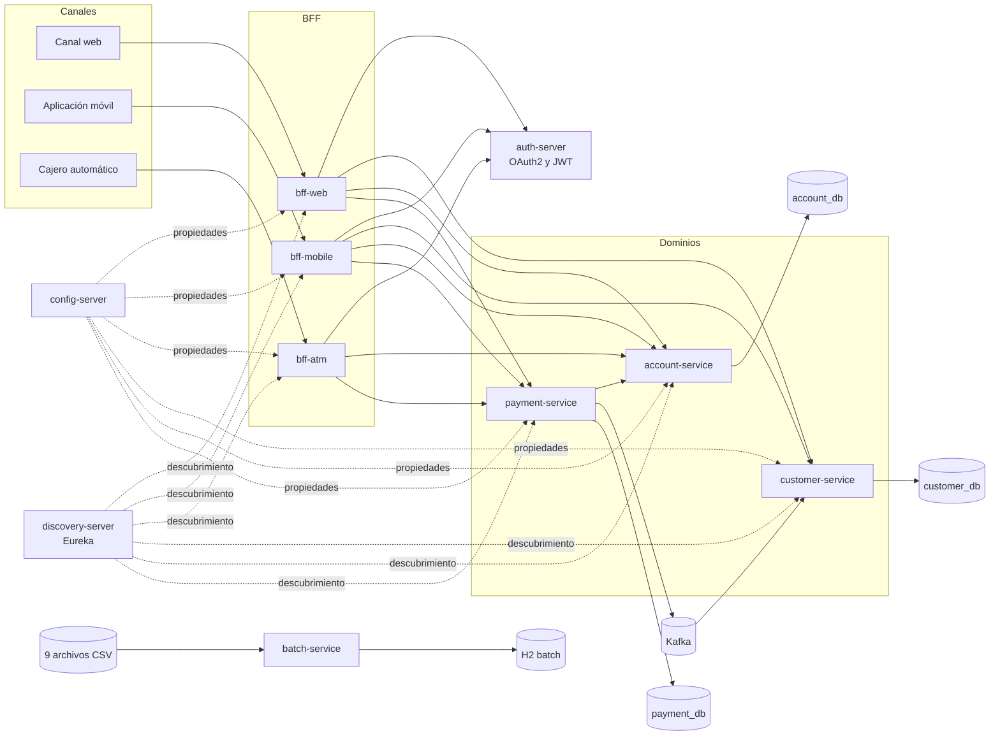

**Figura 1. Arquitectura lógica general.** El servicio batch se mantiene separado del flujo transaccional en línea. Los canales acceden a su BFF y los servicios de negocio permanecen detrás de la red interna.

### 6.2 Componentes y responsabilidades

| Componente | Responsabilidad | Puerto local |
|---|---|---:|
| `batch-service` | Procesamiento y auditoría de los nueve CSV | 8086 |
| `bff-web` | Dashboard detallado y creación de pagos | 8081 |
| `bff-mobile` | Resumen reducido y transferencias | 8082 |
| `bff-atm` | Consulta de saldo y retiros | 8083 |
| `config-server` | Entrega de configuración común y específica | 8888 |
| `discovery-server` | Registro y descubrimiento mediante Eureka | 8761 |
| `auth-server` | Emisión de tokens y publicación de llaves JWT | 9000 |
| `customer-service` | Perfiles, estado, actividad y alertas | 8091 interno |
| `account-service` | Apertura, consulta, débito, crédito y cierre | 8092 interno |
| `payment-service` | Pagos, depósitos, transferencias y retiros | 8093 interno |

### 6.3 Persistencia por dominio

Compose ejecuta una instancia PostgreSQL y crea tres bases lógicas: `customer_db`, `account_db` y `payment_db`. La separación evita que un servicio consulte directamente las tablas de otro. La comunicación se realiza mediante API o eventos. En una instalación productiva, cada base podría trasladarse a una instancia o clúster independiente según los requisitos de aislamiento, costo y disponibilidad.

## 7. Modernización del procesamiento batch

### 7.1 Fuente de datos

La fuente corresponde a nueve archivos CSV distribuidos en `semana_1`, `semana_2` y `semana_3`. Cada semana contiene:

- `movimientos_financieros_diarios.csv`;
- `intereses_trimestrales.csv`;
- `estados_financieros_anuales.csv`.

Los archivos incluyen intencionalmente montos negativos o nulos, fechas en formatos diferentes, tipos desconocidos, campos vacíos, edades fuera de rango y duplicados. La copia original se conserva en `legacy-source`, mientras que otra copia se empaqueta dentro de `batch-service` para que las pruebas sean reproducibles sin depender de una descarga externa.

### 7.2 Flujo común de procesamiento

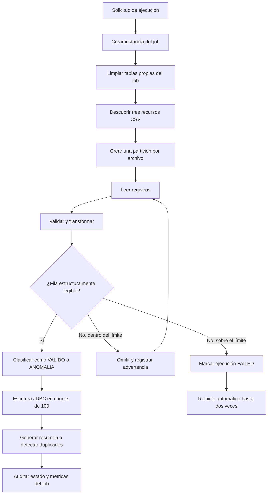

**Figura 2. Flujo general de los jobs.** El tratamiento distingue entre una anomalía de negocio, que se conserva, y una fila que no puede interpretarse estructuralmente.

### 7.3 Job de movimientos diarios

`movimientosDiariosJob` acepta fechas ISO y formatos alternativos presentes en la fuente. Valida que el monto sea mayor que cero y que el tipo corresponda a débito o crédito. Las inconsistencias se almacenan con una observación que puede contener más de una causa. Al finalizar, agrupa los resultados por fecha y calcula cantidad de registros, débitos, créditos, anomalías y montos acumulados.

El job obtuvo 1.020 resultados y 339 resúmenes diarios. De los resultados, 407 fueron clasificados como válidos y 613 como anomalías.

### 7.4 Job de intereses mensuales

`interesesMensualesJob` procesa los archivos denominados `intereses_trimestrales.csv`, manteniendo el nombre recibido de la fuente. Valida identificador de cuenta, titular, saldo, edad y tipo de producto. Para los registros aceptados calcula tasa, interés y saldo final. Un step posterior construye una clave de comparación y marca como anomalía los duplicados encontrados.

El job obtuvo 1.016 resultados: 244 válidos y 772 anomalías.

### 7.5 Job de estados financieros anuales

`estadosFinancierosAnualesJob` valida fecha, cuenta, tipo de transacción, signo del monto y descripción. Los depósitos se consideran entradas y los retiros, compras y pagos se consideran egresos. El resumen final agrupa por cuenta y calcula depósitos, retiros, compras y pagos, movimiento neto, número de operaciones y operaciones rechazadas.

El job obtuvo 1.018 resultados y 20 resúmenes por cuenta. Se clasificaron 295 registros válidos y 723 anomalías.

### 7.6 Resultados consolidados

| Proceso | Resultados | Válidos | Anomalías | Salida agregada |
|---|---:|---:|---:|---:|
| Movimientos diarios | 1.020 | 407 | 613 | 339 resúmenes diarios |
| Intereses mensuales | 1.016 | 244 | 772 | Cálculo por registro |
| Estados financieros anuales | 1.018 | 295 | 723 | 20 resúmenes por cuenta |
| **Total** | **3.054** | **946** | **2.108** | — |

Estos conteos fueron comprobados mediante una prueba de integración que ejecuta los tres jobs sobre una base H2 en memoria. La misma prueba vuelve a ejecutar el job de movimientos y comprueba que el total permanece en 1.020, lo que demuestra que la reejecución no duplica resultados.

### 7.7 Rendimiento, tolerancia a fallos y recuperación

La configuración actual utiliza cuatro threads, un `grid-size` de cuatro y chunks de 100 elementos. Los errores transitorios de acceso a datos se reintentan hasta tres veces, con una espera de 500 milisegundos. Las filas estructuralmente defectuosas se pueden omitir hasta un máximo de 25 por step. Cada ejecución registra inicio, término, identificador, estado, cantidad de steps y excepciones.

Un servicio programado revisa cada cinco segundos la última instancia de los tres jobs. Si encuentra una ejecución `FAILED`, solicita su reinicio y permite hasta dos intentos automáticos. El mecanismo conserva en Spring Batch los metadatos necesarios para continuar y evita reclamar repetidamente la misma ejecución dentro del proceso.

### 7.8 Comparación con el tratamiento legacy

| Aspecto | Fuente o tratamiento legacy | Solución modernizada |
|---|---|---|
| Organización | CSV separados por semana | Jobs con particiones por archivo |
| Validación | Errores presentes sin tratamiento uniforme | Reglas explícitas por tipo de registro |
| Registros defectuosos | Riesgo de descarte o cálculo incorrecto | Conservación como `ANOMALIA` con observación |
| Escalabilidad | Procesamiento principalmente secuencial | Hasta cuatro particiones concurrentes |
| Escritura | Sin control común documentado | Chunks transaccionales de 100 registros |
| Recuperación | Reejecución manual | Reintentos transitorios y reinicio automático |
| Auditoría | Limitada a los archivos | Metadatos Spring Batch, logs y tablas de resultados |
| Repetición | Riesgo de duplicación | Limpieza acotada por job y conteos idempotentes |
| Salidas | Datos operativos sin consolidación común | Resúmenes diarios y anuales consultables |

## 8. Microservicios de negocio

### 8.1 Servicio de clientes

`customer-service` administra datos de identificación, contacto y estado del cliente. El RUT funciona como identificador y el correo es único. La entidad mantiene fechas de creación y actualización, última actividad y una versión para control optimista. El servicio también consume eventos Kafka: una transacción aprobada actualiza la última actividad y una alerta se persiste solo si su identificador aún no existe.

### 8.2 Servicio de cuentas

`account-service` abre cuentas de tipo vista, corriente o ahorro; consulta saldo; lista cuentas por cliente; acredita; debita y cierra cuentas. Antes de modificar el saldo obtiene la cuenta con `PESSIMISTIC_WRITE`. La entidad incorpora además `@Version`, valida que la cuenta esté activa e impide sobregiros. Una cuenta solo puede cerrarse cuando su saldo es cero.

### 8.3 Servicio de pagos

`payment-service` coordina pagos, depósitos, transferencias y retiros. Cada operación se registra con un UUID, una clave de idempotencia única, tipo, cuenta de origen, cuenta de destino, monto, moneda y estado. Los estados principales son `PENDIENTE`, `APROBADO` y `RECHAZADO`.

En una transferencia, el servicio valida ambas cuentas y la moneda, debita el origen y acredita el destino. Si el abono falla después del débito, intenta acreditar nuevamente el origen. Si la compensación también falla, publica una alerta específica. Esta estrategia constituye una saga orquestada simple; mejora la consistencia práctica, aunque no elimina todas las ventanas de fallo de un sistema distribuido.

## 9. Canales Backend for Frontend

Los BFF no comparten código de dominio. Cada uno contiene su controlador, DTOs, cliente HTTP, seguridad y configuración de resiliencia.

| Canal | Operaciones principales | Adaptación de respuesta | Scope |
|---|---|---|---|
| Web | Dashboard y creación de pagos | Cliente completo, cuentas, hasta 20 pagos y advertencias | `web` |
| Móvil | Resumen y transferencia | Nombre, saldo agregado, cuentas activas y hasta 5 movimientos | `mobile` |
| Cajero | Saldo y retiro | Contratos mínimos, moneda, saldo y límite de retiro | `atm.read`, `atm.withdraw` |

Las consultas de web y móvil pueden devolver información parcial. Por ejemplo, si pagos no responde, el dashboard conserva cliente y cuentas y agrega una advertencia. En cambio, transferencias, pagos y retiros lanzan un error de disponibilidad; no generan una respuesta ficticia porque modificar dinero exige certeza sobre el resultado.

## 10. Seguridad distribuida

### 10.1 Emisión y validación de tokens

`auth-server` registra cuatro clientes OAuth2:

| Cliente | Uso | Scopes |
|---|---|---|
| `bff-web` | Canal web | `web` |
| `bff-mobile` | Canal móvil | `mobile` |
| `bff-atm` | Cajero automático | `atm.read`, `atm.withdraw` |
| `internal-services` | Preparación y administración interna | `internal` |

El flujo utilizado es `client_credentials`. Los BFF y los servicios de negocio actúan como Resource Servers y validan la firma del JWT consultando el conjunto de llaves publicado por el servidor de autorización. Las rutas de salud e información son públicas; las rutas de negocio requieren el scope esperado.

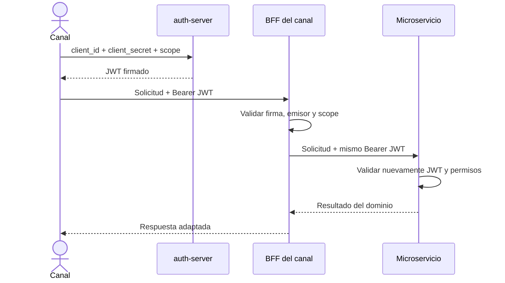

**Figura 3. Propagación y validación del token.** La confianza no termina en el BFF: cada servicio vuelve a validar el token recibido.

### 10.2 HTTPS y credenciales

Los BFF permiten activar HTTPS mediante variables de entorno y un almacén PKCS12. El certificado incluido es autofirmado y se limita a la demostración académica. De igual forma, las contraseñas y secretos presentes en Compose son valores de desarrollo. En un despliegue real deben reemplazarse por secretos administrados, certificados válidos y rotación periódica.

## 11. Resiliencia y consistencia distribuida

### 11.1 Circuit breakers y fallbacks

Los clientes HTTP de los BFF y la comunicación entre pagos y cuentas usan circuit breakers nombrados por dependencia. Las ventanas configuradas consideran diez llamadas y, según el servicio, un mínimo de cinco antes de evaluar la apertura. El circuit breaker de cuentas en `payment-service` permanece abierto diez segundos antes de probar nuevamente.

Los fallbacks se diseñaron según el tipo de operación:

- las consultas pueden devolver listas vacías, datos parciales o una advertencia;
- las operaciones monetarias devuelven un error de disponibilidad;
- el cajero advierte que no se debe reintentar con una clave distinta cuando el resultado de un retiro no es conocido.

### 11.2 Idempotencia

La cabecera `X-Idempotency-Key` es obligatoria para pagos, transferencias y retiros. Antes de ejecutar una operación, `payment-service` consulta si existe un pago con esa clave. Si existe, devuelve el resultado guardado. La restricción única en la base de datos refuerza el control frente a solicitudes concurrentes.

### 11.3 Secuencia de transferencia

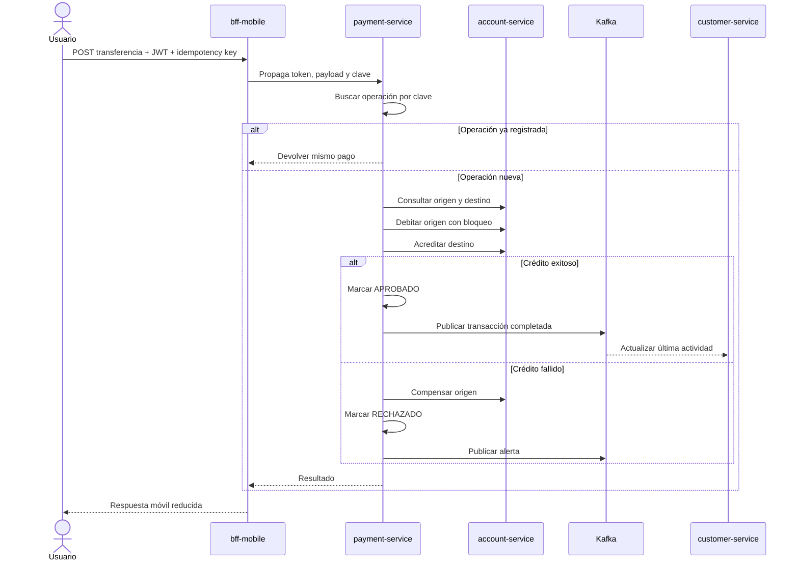

**Figura 4. Transferencia idempotente y compensada.** La clave permite responder de forma estable ante un reintento del canal.

### 11.4 Secuencia de retiro

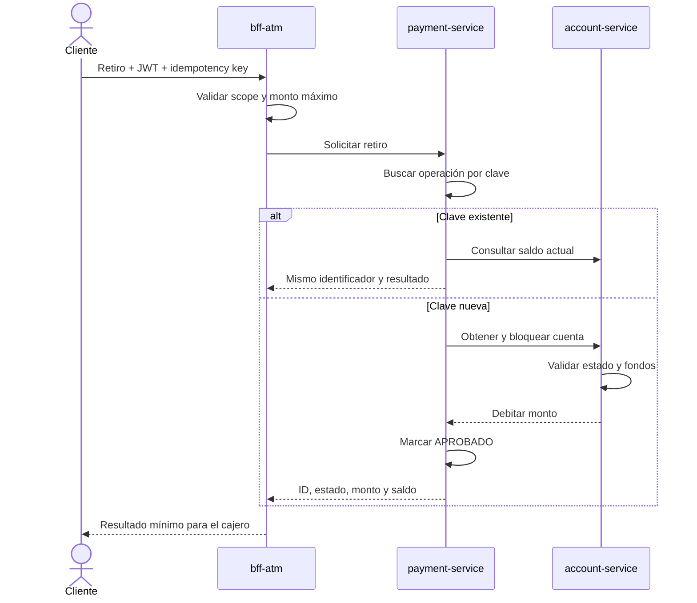

**Figura 5. Retiro por cajero.** El BFF rechaza montos superiores al límite antes de invocar el backend.

## 12. Mensajería Kafka

`payment-service` publica mensajes JSON usando el identificador del pago como clave. Los tópicos configurados son:

| Tópico | Productor | Consumidor | Resultado |
|---|---|---|---|
| `bancoxyz.transacciones.completadas` | `payment-service` | `customer-service` | Actualiza la última actividad del cliente |
| `bancoxyz.alertas.seguridad` | `payment-service` | Monitor de seguridad en `customer-service` | Persiste alertas sin duplicarlas |

Ambos tópicos se configuran con tres particiones. El grupo `customer-service` distribuye transacciones completadas y el grupo `customer-security-monitor` procesa alertas. En el entorno local se usa un solo broker y factor de replicación uno; esto es apropiado para demostración, pero no proporciona tolerancia a la pérdida del nodo.

La publicación actual ocurre después de cambiar el estado de la operación, pero no existe una transacción atómica entre PostgreSQL y Kafka. Si la base confirma y el envío falla, puede quedar una operación aprobada sin evento. La evolución recomendada es implementar transactional outbox, publicar desde una tabla de salida y aplicar reintentos con conciliación.

## 13. Configuración, descubrimiento y balanceo

Config Server trabaja con un repositorio nativo empaquetado. Entrega propiedades comunes —Eureka, JWT, Kafka, Actuator y nombres de tópicos— y propiedades específicas de cada aplicación. Los archivos locales conservan valores alternativos para facilitar pruebas aisladas.

Eureka registra los tres BFF y los tres servicios de negocio. Cada instancia usa un identificador aleatorio, lo que permite publicar varias réplicas del mismo servicio. Los clientes construidos con `@LoadBalanced` llaman a direcciones como `http://account-service`; Spring Cloud resuelve el nombre y selecciona una instancia disponible.

## 14. Despliegue local con Docker Compose

### 14.1 Topología

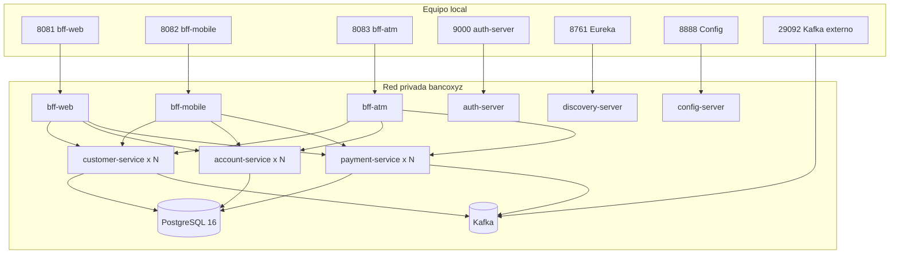

**Figura 6. Despliegue local.** Los servicios de negocio no publican puertos en el host; esta decisión permite escalarlos sin colisiones.

### 14.2 Orden y condiciones de inicio

PostgreSQL y Kafka tienen health checks. Los servicios de negocio esperan la disponibilidad de las dependencias principales, y los BFF se inician después de los servicios que consumen. La configuración y el descubrimiento se declaran como dependencias de arranque. Para un entorno productivo se requieren health checks de aplicación más estrictos y una estrategia de readiness que evite aceptar tráfico antes de completar el registro y la configuración.

### 14.3 Escalamiento horizontal

Los servicios de clientes, cuentas y pagos se pueden escalar con:

```bash
docker compose up -d \
  --scale customer-service=2 \
  --scale account-service=2 \
  --scale payment-service=2
```

La validación levantó dos contenedores de cada servicio y completó una nueva transferencia por el BFF móvil. Esto confirmó que los puertos internos, el registro de instancias y el balanceo permiten la operación con réplicas simultáneas.

## 15. Preparación y estrategia de despliegue en AWS

Los microservicios están preparados para migrar desde Docker Compose hacia un entorno AWS: disponen de imágenes Docker, configuración externalizada mediante variables, descubrimiento por nombre de servicio y capacidad de ejecutar varias instancias. La evidencia práctica de esta entrega corresponde al despliegue local contenerizado y al escalamiento horizontal de clientes, cuentas y pagos. El alcance cloud consiste en explicar cómo se realizaría el despliegue; no incluye aprovisionar recursos en una cuenta AWS.

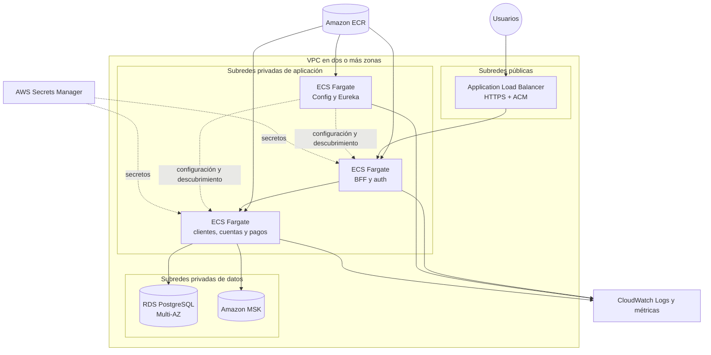

**Figura 7. Arquitectura objetivo en AWS.** Los servicios de negocio, RDS y MSK permanecen en subredes privadas.

Al aplicar el plan, las imágenes se publicarían en Amazon ECR y se ejecutarían como servicios ECS Fargate. Un Application Load Balancer expondría únicamente los BFF y autorización mediante HTTPS con certificados de ACM. RDS PostgreSQL Multi-AZ proporcionaría persistencia, MSK ofrecería Kafka administrado, Secrets Manager mantendría las credenciales y CloudWatch centralizaría logs, métricas y alarmas.

Cada servicio podría escalar según CPU, memoria, latencia o métricas propias. En una evolución productiva, Eureka podría mantenerse en ECS para conservar compatibilidad o reemplazarse por AWS Cloud Map. Config Server podría respaldarse con un repositorio Git privado o sustituir parte de sus funciones por Parameter Store. El procedimiento completo, las variables requeridas y los controles operativos se encuentran en `despliegue.md`.

### 15.1 Proceso propuesto de despliegue

El traslado desde el ambiente local hacia AWS se realizaría de forma gradual y repetible:

1. **Construcción y validación:** ejecutar las pruebas Maven, generar los artefactos JAR y construir una imagen Docker versionada para cada servicio. Antes de publicarlas se comprobarían los health checks y el comportamiento de las imágenes en Compose.
2. **Registro de imágenes:** crear repositorios privados en Amazon ECR, etiquetar cada imagen con la versión de la aplicación y el identificador del commit, y publicarla en el repositorio correspondiente.
3. **Red y aislamiento:** crear una VPC distribuida en al menos dos zonas de disponibilidad. El balanceador se ubicaría en subredes públicas; ECS, RDS y MSK permanecerían en subredes privadas protegidas por security groups.
4. **Persistencia:** aprovisionar PostgreSQL mediante Amazon RDS. Clientes, cuentas y pagos utilizarían bases o esquemas y usuarios separados. Las credenciales quedarían almacenadas en Secrets Manager y no dentro de las imágenes.
5. **Mensajería:** crear Amazon MSK y aprovisionar los tópicos de transacciones y alertas antes de iniciar los consumidores. La cantidad de particiones permitiría distribuir el trabajo entre varias réplicas.
6. **Servicios de soporte:** desplegar Config Server, Eureka y el servidor de autorización como tareas ECS internas. Las direcciones se proporcionarían mediante variables de entorno o DNS privado.
7. **Servicios de negocio:** crear definiciones de tarea y servicios ECS independientes para clientes, cuentas y pagos. Cada definición indicaría imagen, CPU, memoria, puerto, health check, variables y secretos.
8. **Escalabilidad:** configurar inicialmente al menos dos tareas para cada microservicio de negocio y políticas de Application Auto Scaling basadas en CPU, memoria o latencia. Eureka y Spring Cloud LoadBalancer continuarían resolviendo y distribuyendo las llamadas internas.
9. **Entrada segura:** publicar únicamente los BFF y autorización detrás de un Application Load Balancer. HTTPS utilizaría un certificado administrado por ACM; los microservicios de negocio no tendrían acceso público directo.
10. **Observabilidad y validación:** enviar logs y métricas a CloudWatch, crear alarmas y ejecutar pruebas de humo. La validación incluiría autenticación por canal, consulta de salud, transferencia idempotente, consumo Kafka y verificación de las réplicas activas.

### 15.2 Configuraciones que deben externalizarse

Las mismas propiedades utilizadas localmente permiten cambiar de infraestructura sin recompilar las aplicaciones:

| Configuración | Origen propuesto en AWS |
|---|---|
| `CONFIG_SERVER_URL` | DNS privado del servicio Config Server |
| `EUREKA_URL` | DNS privado del servidor Eureka |
| `DATABASE_URL` | Endpoint privado de Amazon RDS |
| `DATABASE_USERNAME` | AWS Secrets Manager |
| `DATABASE_PASSWORD` | AWS Secrets Manager |
| `KAFKA_BOOTSTRAP_SERVERS` | Brokers TLS de Amazon MSK |
| `JWT_JWK_SET_URI` | Endpoint controlado del servidor de autorización |
| Secretos OAuth2 | AWS Secrets Manager |

Este procedimiento demuestra que la solución no depende de direcciones codificadas dentro de los artefactos. Docker empaqueta cada aplicación, mientras que las variables de entorno y los secretos determinan su conexión con los componentes del ambiente donde se ejecute.

## 16. Estrategia de pruebas

### 16.1 Cobertura automatizada

El reactor Maven contiene 20 clases o suites de prueba y 35 casos. La ejecución limpia finalizó con cero fallos, cero errores y cero pruebas omitidas.

| Módulo | Casos | Aspectos principales |
|---|---:|---|
| `batch-service` | 7 | Contexto, formatos, anomalías, cálculos, nueve CSV, idempotencia y recuperación |
| `bff-web` | 6 | Contexto, dashboard degradado, autenticación y scope web |
| `bff-mobile` | 5 | Contexto, datos parciales, autenticación y scope mobile |
| `bff-atm` | 8 | Contexto, idempotencia, límite de retiro, autenticación y separación de scopes de consulta y retiro |
| `config-server` | 1 | Carga del contexto |
| `discovery-server` | 1 | Carga del contexto Eureka |
| `auth-server` | 1 | Carga del servidor de autorización |
| `customer-service` | 2 | Alta activa y rechazo de RUT duplicado |
| `account-service` | 3 | Débito correcto, prevención de sobregiro e integración de débito y crédito con PostgreSQL mediante Testcontainers |
| `payment-service` | 1 | Compensación cuando falla el crédito destino |
| **Total** | **35** | **0 fallos, 0 errores y 0 omitidas** |

### 16.2 Evidencia de compilación

| Verificación | Resultado observado el 07-10-2026 |
|---|---|
| `mvn -B clean test` | 35 pruebas, 0 fallos, 0 errores, 0 omitidas |
| `mvn -B -DskipTests package` | Empaquetado correcto de los diez módulos |
| `docker compose config --quiet` | Configuración válida |
| `docker compose up -d --build` y escalamiento | Nueve imágenes Java, catorce contenedores activos y un inicializador Kafka completado |
| Health de Config, Eureka y tres BFF | Cinco respuestas con estado `UP` |

### 16.3 Evidencia funcional de extremo a extremo

La prueba integral utilizó un cliente de demostración, dos cuentas CLP y tokens reales emitidos por `auth-server`.

| Comprobación | Evidencia obtenida |
|---|---|
| Clientes OAuth2 | Tokens emitidos para web, móvil, cajero e interno |
| Ruta sin token | HTTP `401` en el resumen móvil |
| Descubrimiento | `ACCOUNT-SERVICE`, `CUSTOMER-SERVICE`, `PAYMENT-SERVICE` y tres BFF en Eureka |
| Kafka | Dos tópicos existentes, cada uno con tres particiones |
| Transferencia inicial | ID `aa2c1677-059c-4f5a-978e-60b12301d912`, estado `APROBADO`, monto 10.000 CLP |
| Reintento de transferencia | Mismo ID y sin segundo débito |
| Saldos posteriores | Origen 90.000 CLP y destino 60.000 CLP |
| Evento Kafka | Evento de la transferencia localizado en el tópico de transacciones |
| Consumo | Última actividad actualizada a `2026-10-07T17:01:05.373684Z` sin reiniciar servicios |
| Escalamiento | Dos contenedores para clientes, cuentas y pagos |
| Operación escalada | Transferencia `aa2c1677-059c-4f5a-978e-60b12301d912` aprobada |
| Retiro | ID `83c17107-7425-48f9-8bc6-b2cf0d6ac987`, 20.000 CLP, saldo final 70.000 CLP |
| Reintento de retiro | Mismo ID y mismo saldo final |
| Dashboard web | Cliente, dos cuentas, transferencia aprobada y ninguna advertencia |

Los identificadores corresponden únicamente a la ejecución local de demostración y permiten relacionar las respuestas HTTP, los registros persistidos y los eventos.

### 16.4 Evidencias visuales de la ejecución

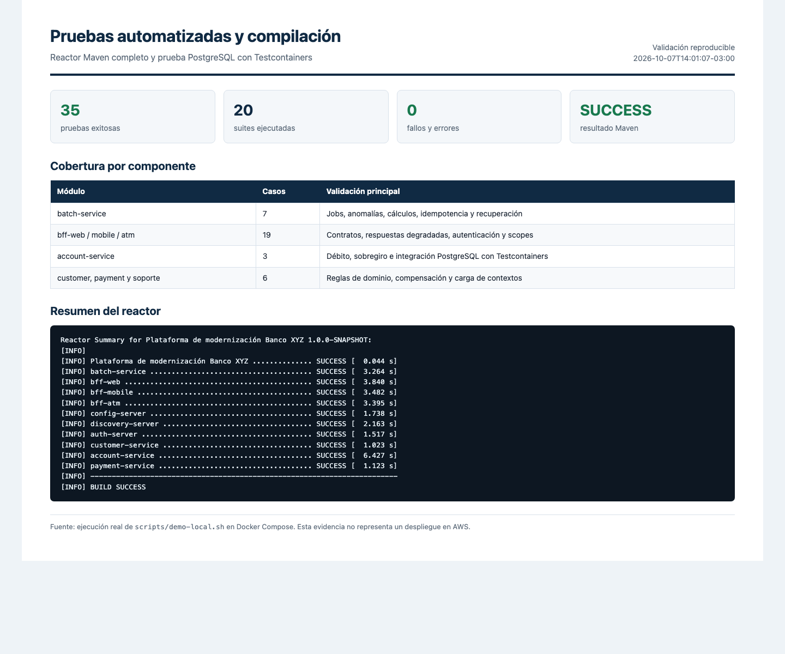

**Figura 8. Pruebas automatizadas y compilación.** La ejecución del reactor completó 35 pruebas en 20 suites, sin fallos ni errores.

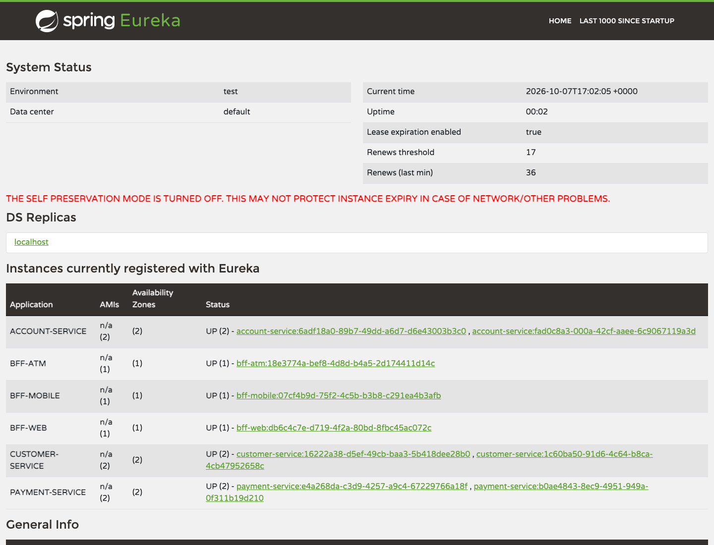

**Figura 9. Registro y escalamiento en Eureka.** La vista muestra seis aplicaciones y dos instancias activas para clientes, cuentas y pagos.

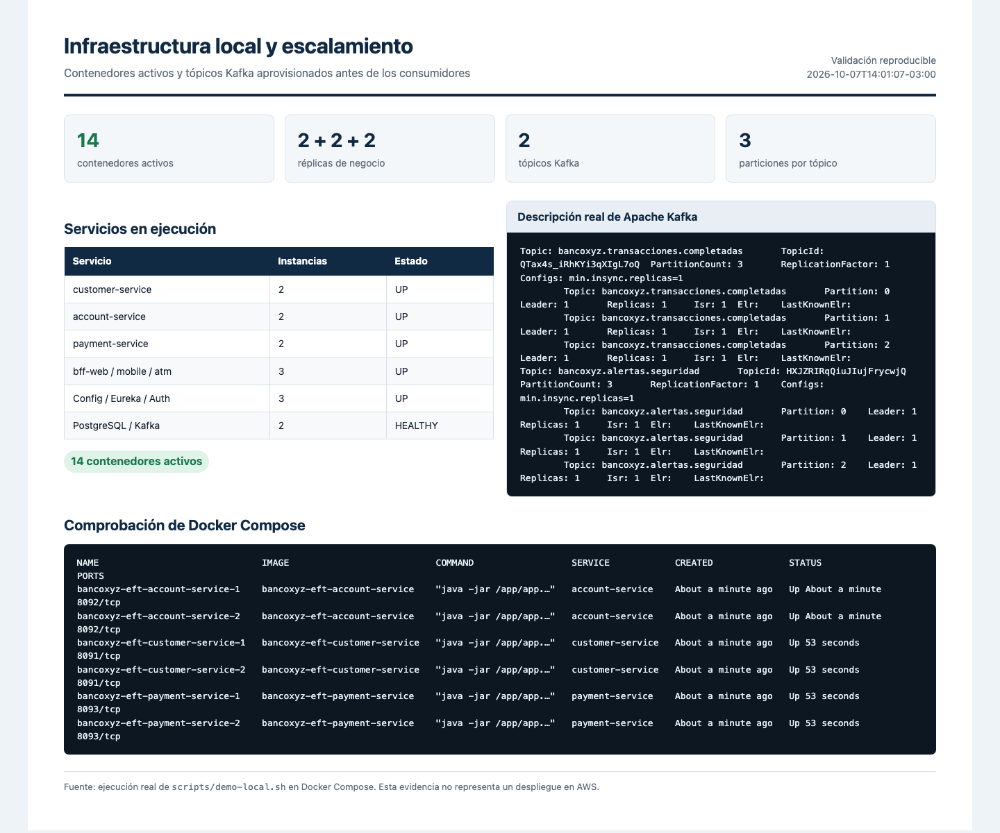

**Figura 10. Infraestructura local.** Docker Compose mantuvo catorce contenedores activos y Kafka confirmó tres particiones para cada tópico.

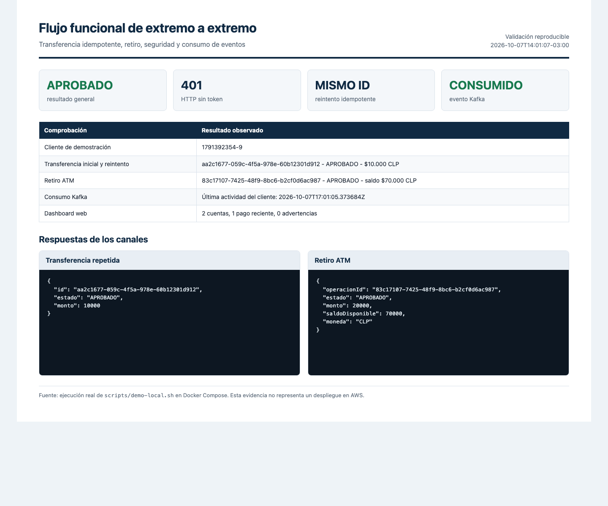

**Figura 11. Flujo funcional de extremo a extremo.** La transferencia conservó el mismo identificador al repetirse, el retiro fue aprobado, la ruta sin token respondió 401 y el evento Kafka actualizó al cliente.

## 17. Observabilidad

Los servicios exponen endpoints Actuator de salud, información y métricas. Los BFF publican métricas generales y `payment-service` expone además el estado de circuit breakers. Los logs se escriben en salida estándar, por lo que Compose puede consultarlos con `docker compose logs` y una plataforma cloud puede enviarlos a un sistema centralizado.

Para producción se recomienda incorporar identificadores de correlación en solicitudes y eventos, métricas de negocio —operaciones aprobadas, rechazadas y compensadas—, trazas distribuidas con OpenTelemetry y alertas sobre latencia, errores 5xx, circuit breakers abiertos, lag de consumidores y fallos de jobs.

## 18. Hallazgos, limitaciones y riesgos

### 18.1 Inicialización determinista de Kafka

Una ejecución inicial reveló que `customer-service` podía suscribirse antes de que `payment-service` declarara los tópicos con tres particiones. Kafka los creaba temporalmente con una partición y el grupo consumidor podía conservar una asignación incompleta hasta el siguiente rebalanceo.

La condición se corrigió incorporando `kafka-init` en Compose. Este contenedor crea ambos tópicos con tres particiones y termina correctamente; los servicios de clientes y pagos solo se inician después de esa finalización. La demostración final comprobó el consumo y la actualización de la última actividad sin reinicios manuales. En AWS, el mismo principio se aplicaría aprovisionando los tópicos de MSK antes de desplegar productores y consumidores.

### 18.2 Consistencia entre base de datos y Kafka

La escritura de la operación y la publicación del evento no comparten una transacción. Transactional outbox y un publicador reintentable reducirían la posibilidad de que exista un pago aprobado sin evento. Una tarea de conciliación debería detectar operaciones sin publicación confirmada.

### 18.3 Seguridad del entorno académico

El flujo `client_credentials` representa clientes técnicos y no autentica a una persona final. Las credenciales, el certificado PKCS12 y las contraseñas incluidas son de demostración. Un ambiente real requiere autorización de usuarios, secretos administrados, TLS válido, rotación, scopes más granulares y restricción de Actuator a una red de monitoreo.

### 18.4 Infraestructura local sin alta disponibilidad

Compose utiliza un solo PostgreSQL y un solo broker Kafka con factor de replicación uno. La pérdida de esos contenedores interrumpe el servicio, aunque el volumen PostgreSQL conserva datos al ejecutar `docker compose down` sin `-v`. AWS RDS Multi-AZ y MSK con replicación adecuada resuelven este riesgo en el diseño objetivo.

### 18.5 Evolución del esquema

Los microservicios usan `spring.jpa.hibernate.ddl-auto=update`, apropiado para la demostración pero poco controlable en producción. Se recomienda incorporar Flyway o Liquibase y versionar cada cambio de esquema.

### 18.6 Pruebas pendientes

La suite ya valida reglas de negocio, combinaciones válidas e inválidas de scopes y una integración con PostgreSQL real mediante Testcontainers. El script de demostración cubre además autenticación, APIs HTTP, idempotencia, descubrimiento, escalamiento y consumo Kafka de extremo a extremo; la colección Postman permite repetir los principales contratos manualmente. Como trabajo futuro quedan las pruebas Kafka aisladas con Testcontainers, pruebas formales de contrato, concurrencia intensiva, rendimiento y recuperación ante la caída de dependencias. Una eventual ejecución controlada en AWS serviría como validación futura de portabilidad, pero no forma parte del alcance de esta entrega.

## 19. Desafíos enfrentados y soluciones

| Desafío | Solución aplicada |
|---|---|
| Datos legacy con formatos inconsistentes | Parsers tolerantes, validaciones y clasificación de anomalías |
| Procesamiento repetible de varios archivos | Particionado, limpieza acotada e integración idempotente |
| Evitar débitos duplicados | Clave de idempotencia persistida y única |
| Actualizaciones concurrentes de saldo | Bloqueo pesimista y versión de entidad |
| Falla después del débito | Compensación hacia la cuenta de origen |
| Diferencias entre canales | Tres BFF con contratos y permisos independientes |
| Dependencias temporalmente caídas | Circuit breakers y fallbacks según tipo de operación |
| Direcciones variables al escalar | Eureka y LoadBalancer por nombre de servicio |
| Procesamiento posterior desacoplado | Productores y consumidores Kafka |
| Reproducción de la plataforma | Reactor Maven, Dockerfiles y Compose |

## 20. Próximos pasos

1. Incorporar transactional outbox y conciliación de eventos.
2. Añadir migraciones Flyway o Liquibase por microservicio.
3. Publicar una especificación OpenAPI complementaria a la colección Postman.
4. Ampliar las pruebas con Testcontainers para Kafka y pruebas formales de contrato HTTP.
5. Agregar pruebas de concurrencia, rendimiento y recuperación ante fallas.
6. Añadir trazas distribuidas, correlación y paneles de métricas.
7. Extender la canalización de integración continua con análisis de dependencias y construcción de imágenes.
8. Si el proyecto evoluciona más allá del alcance académico local, publicar imágenes versionadas en ECR y validar el diseño en un entorno AWS controlado.
9. Sustituir secretos y certificados académicos antes de cualquier uso fuera del entorno de demostración.

## 21. Conclusiones

La solución demuestra una modernización coherente del procesamiento y de la operación bancaria. Spring Batch aporta una estructura auditable y recuperable para datos heterogéneos; los microservicios delimitan responsabilidades; los BFF responden a necesidades reales de cada canal; OAuth2 y JWT aplican controles consistentes; y Kafka permite extender el sistema sin incorporar dependencias directas.

Las pruebas confirmaron las propiedades principales: los nueve archivos se procesan con conteos repetibles, los saldos no se duplican ante reintentos, una falla de crédito activa compensación, los canales reciben respuestas diferenciadas y los servicios pueden operar con más de una instancia. La ejecución integral también permitió identificar y corregir una condición de arranque de Kafka que no era visible en las pruebas unitarias. La inicialización determinista de tópicos convirtió esa observación operativa en una mejora comprobada mediante una nueva ejecución completa.

El sistema está preparado como demostración académica reproducible y cuenta con una ruta razonable hacia un entorno administrado. Para aproximarse a producción, las prioridades son fortalecer la entrega de eventos, formalizar las migraciones, ampliar las pruebas de integración y seguridad, centralizar observabilidad y desplegar la infraestructura cloud propuesta.

## Anexo A. Endpoints principales

| Componente | Método y ruta | Propósito |
|---|---|---|
| Batch | `POST /api/batch/jobs/{jobName}` | Ejecutar un job permitido |
| Batch | `GET /api/batch/executions/{id}` | Consultar una ejecución |
| Web | `GET /api/web/clientes/{rut}/dashboard` | Obtener dashboard agregado |
| Web | `POST /api/web/pagos` | Crear un pago idempotente |
| Móvil | `GET /api/mobile/clientes/{rut}/resumen` | Obtener resumen reducido |
| Móvil | `POST /api/mobile/transferencias` | Ejecutar transferencia |
| Cajero | `GET /api/cajero/cuentas/{numero}/saldo` | Consultar saldo |
| Cajero | `POST /api/cajero/retiros` | Ejecutar retiro idempotente |
| Clientes | `POST /api/clientes` | Crear cliente |
| Clientes | `GET /api/clientes/{rut}` | Consultar cliente |
| Clientes | `PUT /api/clientes/{rut}` | Actualizar cliente |
| Clientes | `PATCH /api/clientes/{rut}/estado/{estado}` | Cambiar estado |
| Cuentas | `POST /api/cuentas` | Abrir cuenta |
| Cuentas | `GET /api/cuentas?rutCliente=...` | Listar cuentas |
| Cuentas | `POST /api/cuentas/{numero}/debitar` | Debitar con bloqueo |
| Cuentas | `POST /api/cuentas/{numero}/acreditar` | Acreditar con bloqueo |
| Pagos | `POST /api/pagos` | Procesar pago o depósito |
| Pagos | `POST /api/pagos/transferencias` | Transferir entre cuentas |
| Pagos | `POST /api/pagos/retiros` | Procesar retiro |
| Pagos | `GET /api/pagos?rutCliente=...` | Consultar movimientos |

## Anexo B. Reproducción de la validación

```bash
# Pruebas y empaquetado
mvn -B clean test
mvn -B -DskipTests package

# Plataforma, escalamiento y flujo integral
./scripts/demo-local.sh

# Cierre sin eliminar el volumen de datos
docker compose down
```

La secuencia completa para emitir tokens, preparar datos y probar cada canal se encuentra en `instrucciones.md`. El script conserva automáticamente la evidencia en `docs/evidencias/ultima-ejecucion`.

## Anexo C. Archivos de evidencia

La ejecución automatizada conserva sus resultados en `docs/evidencias/ultima-ejecucion`. Esta carpeta contiene los logs de Maven, el estado de Docker Compose, las aplicaciones registradas en Eureka, la descripción de los tópicos Kafka y las respuestas JSON de los tres canales. Las capturas incorporadas en la sección 16 se generaron a partir de esos archivos y del dashboard real de Eureka.

No se almacenan tokens OAuth2. Los UUID, números de cuenta y datos visibles pertenecen al cliente académico creado automáticamente por `scripts/demo-local.sh`.

## Referencias

- Repositorio del proyecto: <https://github.com/crnahuas/Backend_3_EFT>
- Fuente legacy utilizada: <https://github.com/KariVillagran/fin_legacy_data>
- Spring Batch Reference Documentation: <https://docs.spring.io/spring-batch/reference/>
- Spring Cloud: <https://spring.io/projects/spring-cloud>
- Apache Kafka Documentation: <https://kafka.apache.org/documentation/>
- OAuth 2.0, RFC 6749: <https://www.rfc-editor.org/rfc/rfc6749>
- JSON Web Token, RFC 7519: <https://www.rfc-editor.org/rfc/rfc7519>
- Docker Compose Documentation: <https://docs.docker.com/compose/>
- AWS Architecture Center: <https://aws.amazon.com/architecture/>
